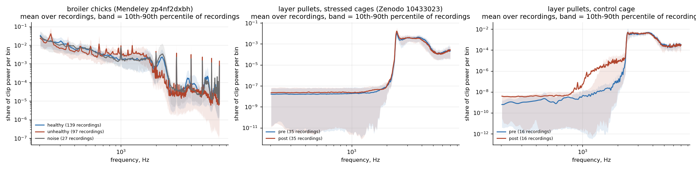
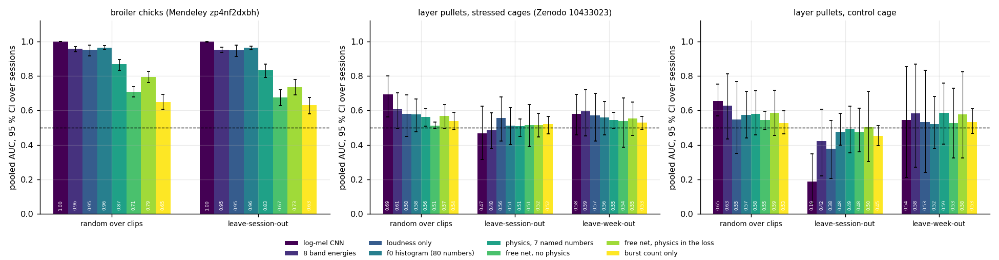
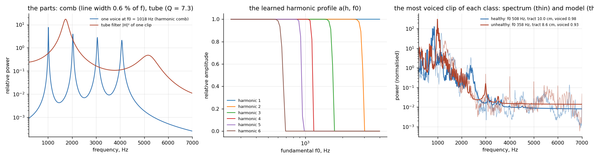
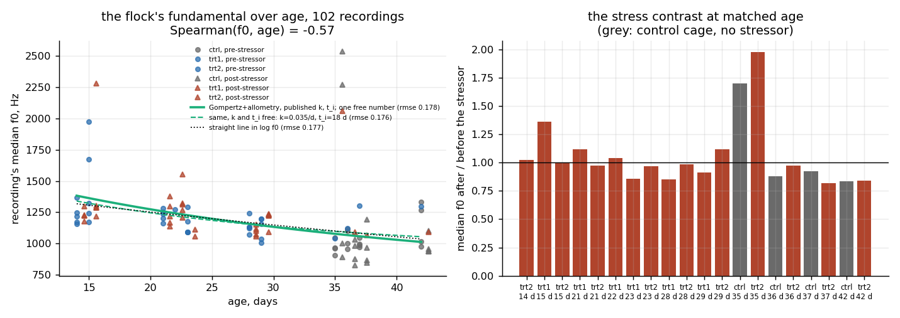
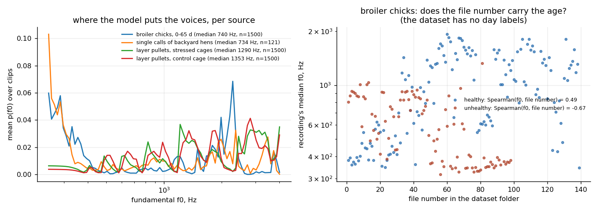

# What a poultry house says, and what an AI can hear in it

Reviews of AI in poultry report respiratory-disease and distress
classifiers at 94 % and above from audio [1-3]. Almost all of those numbers
come from random splits of clips recorded in one house. The same reviews
name that as the field's central weakness. This repository puts three open
poultry recordings through one question: **what survives a recording
session the model has never heard?** The recordings are broiler chicks
labelled healthy or unhealthy, layer pullets recorded before and after an
acute stressor, and single calls of backyard hens.

Three readings of the sound are compared under protocols that get harder.
The first is a log-mel convolutional network, which is what the literature
uses. The second is eight band energies, which is what a chart shows. The
third is a **physics-based spectral mixture model of the flock as a
population of source-filter voices**. Each voice is a syrinx comb passed
through a tracheal tube, and the population sits over a background. Such a
model can only explain a spectrum through the harmonics of a voice, and
every quantity it returns has a physical name. The same fundamental,
tracked over weeks, is then fitted with a growth law. Allometry and
Gompertz growth say how a flock's voice should fall with age. The page
reports whether it does, and whether the data can tell that law from a
straight line.

Two things to say before any number. **No health or stress detector is
delivered here.** The page is a set of measurements on other people's
recordings, most of them negative, with intervals. And a word on the name.
The mixture model is fitted by gradient descent and carries a small network
for one shape function, but it is not a PDE-residual PINN. The control that
*is* "physics as a loss term" is a free network penalised towards the
physical fit. It runs alongside and is scored in the same tables.

---

## Three recordings, none redistributed

`data/SOURCE.md` says where each source lives, who to cite, and where each
source's description disagrees with its files.

| source | what | recordings | the session a clip belongs to |
|---|---|---|---|
| Mendeley `zp4nf2dxbh` (Adebayo et al. 2023) [5] | broiler chicks; two groups in two rooms with two microphones, one treated for respiratory disease and one not; recorded three times a day for 65 days; the untreated group's recordings after day 30 are the *Unhealthy* folder | 139 / 121 / 86 WAV, 48 kHz | the recording. No day, pen or bird in the file names |
| Zenodo `10433023` (Neethirajan 2023) [4, 6] | white-egg layer pullets, 2 to 6 weeks old, an hour **before** and **after** an acute stressor (umbrella, dog barking) each protocol week; a control cage with no stressor | 70 + 32 MP3 of 17.7 min, no energy below 2 kHz as released | the cage-hour. The files `_1.._4` are four microphones on the same birds at the same time |
| GitHub `zebular13/ChickenLanguageDataset` | single calls of backyard hens, named by meaning | 126 WAV | used only for the f₀ survey; no licence file, see SOURCE.md |

Clips are two seconds long at 16 kHz, at most 60 per recording, so that no
fifteen-minute file dominates. That gives 3 439 broiler clips from 236
recordings, 4 200 pullet clips from 34 sessions in the stressed cages, and
1 920 clips from 8 sessions in the control cage. **Everything is replicated
at the level of the session.** Every interval on this page is a bootstrap
over sessions. Every p-value is a session-level permutation.

---

## Five findings

| # | Finding | Evidence |
|---|---------|----------|
| 1 | **The broiler classes are separable by recording condition, and nothing here can say by what.** The network scores AUC 1.00 on a random split and 1.00 [1.00, 1.00] on sessions it has never heard. Clip loudness alone scores 0.95 [0.91, 0.98]. The dataset's own description explains why that is uninformative: the two classes are two groups of birds in two rooms with two microphones, and the unhealthy class was recorded only after day 30. Room, gain, age and disease are one variable in these files. | One network, three splits |
| 2 | **An acute stressor leaves nothing this page can measure in 18 minutes of flock sound.** Before-versus-after in the stressed cages, on a held-out week: the network 0.58 [0.46, 0.69], permutation p = 0.12; on held-out sessions 0.47 [0.32, 0.62]. The control cage, where nothing happened between "before" and "after", gives 0.54 [0.21, 0.85] on a held-out week and 0.19 [0.06, 0.35] on held-out sessions. That is below chance, because the network learns which day a clip is from, not whether anything happened. | One network, three splits |
| 3 | No reading of the sound does better, physical or free. Seven named physical numbers: 0.51 [0.45, 0.55] on held-out sessions, 0.55 [0.50, 0.59] on a held-out week. A free network with the physics as a loss term: 0.52 / 0.55. Without it: 0.51 / 0.54. Every interval crosses 0.5. | A source-filter model of the flock |
| 4 | **The flock's fundamental falls with age, weakly.** Spearman −0.35, 95 % CI [−0.65, −0.01], over 42 sessions from 14 to 42 days. (v1 reported −0.57 over "102 recordings"; those were microphones, not observations.) A Gompertz-allometry curve with a *published* growth rate and inflection age and one free constant fits it with log-RMSE 0.138. A straight line with two free numbers fits with 0.135 (ΔBIC = +1.9). The two are indistinguishable. Freed, the fit runs to a step at the first week (k = 0.390 /day, CI [0.042, 0.733]; t_i = 14 d, CI [0, 15]). That is a degenerate curve, not a growth parameter. | Growth read from the fundamental |
| 5 | The model knows what a voice looks like. It does not know what a chicken is, and two of its numbers are not what they claim. Its "tract length" is not identified by these spectra (14 % of clips sit at a bound of the allowed range, and the loss is flat across it), so it is reported but not used. Its f₀ survey moves with the grid it is given: the broiler median is 898 Hz on the 250 Hz to 4 kHz grid and 402 Hz on 150 Hz to 6 kHz. | A source-filter model of the flock; Where the voices land |

---

## Spectra before any model



Mean spectrum per class over sessions, with the 10th to 90th percentile of
sessions shaded. Two things are visible before any model is fitted. In the
broiler set the *Noise* folder looks like the other two. The bird sound is
a minority of the power: only 13 % of it lies above 2 kHz, where a chick's
peep is. Healthy and unhealthy differ across the whole band, including
where no chick vocalises. In the pullet set the released files carry
nothing below 2 kHz. The record says the audio was de-noised and normalised
before release; whether that step, a high-pass or the codec removed the
band is not stated. So the only thing left is the chick's voice band. After
a stressor the 2 to 3 kHz share rises from 0.30 to 0.41, while the control
cage moves from 0.28 to 0.32.

---

## One network, three splits



A small convolutional network on log-mel spectrograms is trained the same
way under each protocol. It runs 12 epochs and three seeds with
probabilities averaged, and it is an untuned baseline, labelled as such.
**Random** means five stratified folds over clips, with clips from the same
session on both sides. This is how most published results are produced.
**Session** means five folds over whole sessions. **Week** means leave one
protocol week out (pullets). Folds under the last two can be single-class,
so out-of-fold scores are pooled and scored once. The 95 % interval comes
from resampling sessions and the p-value from permuting labels at the
session level.

| dataset · task | random | session | week |
|---|---|---|---|
| broiler · healthy vs unhealthy, CNN | 1.00 [1.00, 1.00] | 1.00 [1.00, 1.00] | — |
| broiler · the same, clip loudness only | 0.95 | 0.95 [0.91, 0.98] | — |
| pullets, stressed cages · before vs after, CNN | 0.69 [0.56, 0.80] | 0.47 [0.32, 0.62] | 0.58 [0.46, 0.69] |
| pullets, control cage · "before" vs "after", CNN | 0.65 [0.57, 0.75] | 0.19 [0.06, 0.35] | 0.54 [0.21, 0.85] |

The broiler row says what the dataset's description already implies.
Whatever differs between the *Healthy* and *Unhealthy* folders is in every
clip, and loudness alone finds it on sessions it has never seen. The
description names three candidates that cannot be separated in these
files: a different room and microphone, a different age window (only birds
past day 30 are in the unhealthy folder, and a bird's voice drops with
age), and the disease. A quieter, lower-voiced older flock is consistent
with all three. A classifier at 1.00 has learned that difference. Nothing
on this page can say which part of it is biology.

The pullet rows are the stress question asked properly. Under the session
protocol the four microphones of one cage-hour stay together. An earlier
version of this page split them and reported 0.63 here; that was a leak,
and it is gone. The control cage, where the two labels are the same hour
repeated, is the false-positive rate of the whole method, and the stressed
cages do not separate from it. The control cage's session number is
*below* chance, with an interval that excludes 0.5. The beehive repository
found the same signature. With eight sessions in four before/after pairs,
the network scores a held-out hour by its nearest training hour, which is
the other half of the same day with the opposite label. A model that had
learned nothing would sit at 0.5. This one has learned the day, and says
so.

---

## A source-filter model of the flock



A chicken is a source-filter system. The syrinx sets a fundamental f₀ and
its harmonics. The trachea and open beak are a tube, closed at the syrinx
and open at the beak, with resonances at odd quarter-wavelengths,
F_m = (2m−1)·c/(4L). A clip of flock sound is written as a population of
such voices over a background, and nothing else:

    S(f) = g · [ ( Σₖ p(f₀ₖ) Σₕ a(h, f₀ₖ) L(f; h·f₀ₖ, ε·h·f₀ₖ) ) · |H_L(f)|²  +  B(f) ]

p(f₀) is the distribution of fundamentals in the clip, on 80 points of a
log grid from 250 Hz to 4 kHz. a(h, f₀) is the harmonic profile of one
voice, a small network shared by every clip. The line width is a fixed
*fraction* ε of the harmonic's frequency, because pitch jitter is relative.
|H_L|² is the three-formant tube filter with one length L per clip and one
quality factor shared by all. B(f) is a power-law background per clip. The
physics lives in the structure of the model, two shared numbers (ε, Q) and
one tract length per clip, not in a loss term. The model is fitted to the
spectra alone by log-spectral error. Bins below −40 dB of the clip mean are
masked, so the empty band of the pullet files is not fitted as zeros.
**The label never enters the fit.** Under the session and week protocols
the shared physics is refitted on the training sessions and frozen before
the held-out clips are decomposed.

### What the fit finds

A line width of 0.6 % of frequency, a tube Q of 7.3, and a harmonic
profile that is flat until a harmonic leaves the band. In other words, the
network learned that harmonics above 7 kHz do not exist, and nothing else.
The backyard hens' single calls decompose to a median f₀ of 779 Hz, the
pullets to 1285 Hz, and the broiler recordings to 898 Hz. On the pullet
files the voiced share collapses to a few percent. A model that needs the
250 Hz to 2 kHz band cannot see a voice in a file that has none, and the
f₀ it reports there is read off a decomposition that has mostly given up.

### Two numbers that are not what they claim

The tract length L is reported per clip, and it is not identified by these
spectra. The loss profile over L is flat for typical clips (figure 4,
right), and 14 % of clips sit at a bound of the allowed range. The medians
per source (9.1 cm for the single calls, 22.4 cm for the pullets) are where
the optimiser stopped, not where a trachea is. It is kept in the result
files and left out of the predictive set. The f₀ survey depends on the
grid. Refitting the same clips on 150 Hz to 6 kHz moves the broiler median
from 898 to 402 Hz and the single calls from 779 to 394 Hz. Whatever is
periodic in a noise-dominated recording is decomposed into "voices" at any
fundamental the grid allows.

### What the numbers are worth

Seven quantities per clip go into a logistic regression under the same
protocols. Five come from the spectrum: f₀ mean and spread, voiced share,
background slope and level. Two come from the waveform: the count and
energy share of broadband bursts of under 80 ms in the 1 to 7.5 kHz band
(`src/transients.py`). The burst
counter is validated on synthetic bursts, not on labelled rales, and the
codec section below checks what MP3 does to it. Next to the seven
quantities sit the band energies, the full f₀ histogram, the network, and
two free-network controls. One control is an 8-number embedding per clip
learned by a spectral MLP with no physics. The other is the same embedding
with the physics added as a penalty towards the mixture model's fit
(λ = 1).

| reading of the sound (pullets, stressed cages) | random | session | week |
|---|---|---|---|
| log-mel CNN | 0.69 | 0.47 [0.32, 0.62] | 0.58 [0.46, 0.69] |
| 8 band energies | 0.61 | 0.48 [0.38, 0.59] | 0.59 [0.45, 0.72] |
| loudness only | 0.58 | 0.56 [0.42, 0.68] | 0.57 [0.42, 0.70] |
| f₀ histogram, 80 numbers | 0.58 | 0.51 [0.40, 0.61] | 0.56 [0.46, 0.65] |
| **physics built into the model, 7 named numbers** | 0.56 | 0.51 [0.45, 0.55] | 0.55 [0.50, 0.59] |
| free network, no physics (8 numbers) | 0.51 | 0.51 [0.39, 0.63] | 0.54 [0.39, 0.67] |
| free network, physics as a loss term | 0.57 | 0.52 [0.44, 0.58] | 0.55 [0.45, 0.65] |
| burst count and share only | 0.54 | 0.52 [0.47, 0.57] | 0.53 [0.49, 0.57] |
| *control cage, physics (nothing happened)* | 0.58 | 0.49 [0.35, 0.62] | 0.59 [0.41, 0.76] |

No row separates from the control cage, and no interval on the week
protocol excludes 0.5. The best reading on a held-out week is band energies
at 0.59 [0.45, 0.72], permutation p = 0.09. The free network with the
physics as a loss term scores 0.55 on a held-out week, the same as the
physics built into the model (0.55). Neither is ahead of the free network
with no physics at all (0.54). With no signal to carry, the form of the
physics cannot matter, and this table is not evidence for or against it.
What the physical numbers do give is a readable session-level view. It
says which named quantity moves most between 'before' and 'after': voiced
share, AUC 0.66 over sessions in the stressed cages. It also says that the
same quantity moves as much in the control cage (0.69).

---

## Growth read from the fundamental



Across bird species the fundamental of a call falls with body mass as a
power law f₀ ∝ M^(−α). Geometric similarity (every length ∝ M^(1/3)) gives
α = 1/3, and Fletcher's optimal-communication rule gives α = 0.4 [7]. A
growing flock's mass follows a Gompertz law
M(t) = M∞·exp(−exp(−k(t−t_i))). Together:

    f₀(t) = f₀∞ · exp( α · exp(−k (t − t_i)) )

Here f₀∞ = a·M∞^(−α) is the one number a microphone can identify on its
own. k and t_i are the growth parameters of the flock, and those a
hatchery publishes. α = 1/3 is used below and α = 0.4 is run as a
sensitivity. With α = 0.4 the one-free RMSE is 0.144 and the freed fit
gives k = 0.390 /d, t_i = 13 d. The test is this. Take k = 0.02 /day and
t_i = 53 d from a published Gompertz fit for white-egg layer pullets
(Hy-Line; Oliveira et al. 2018 [8]) and leave one free constant. Then see
whether the flock's fundamental over the recorded weeks follows the curve.
Two assumptions are carried and tested. The exponent is a cross-species
scaling applied within one growing flock. The age is the protocol week plus
an offset the files do not contain (week 1 day 1 = day 14, from the
preprint).

Only sessions with at least five voiced clips (voiced share > 0.2) enter,
so that the fundamental is read off a decomposition that found a voice.
That is 42 of 42 sessions.

| model of f₀ over age, 42 sessions | free numbers | log-RMSE | BIC |
|---|---|---|---|
| Gompertz + allometry, published k and t_i | 1 | 0.138 | -159.1 |
| Gompertz + allometry, all free (k = 0.390 /d, t_i = 14 d) | 3 | 0.117 | -165.0 |
| straight line in log f₀ | 2 | 0.135 | -157.1 |

The direction is there and the discrimination is absent. The fundamental
falls from about 1201 Hz at 14 days to about 884 Hz at 42, as allometry
says a growing bird's should. But with the session as the unit the
correlation is -0.35, with an interval that reaches -0.01. The sign is
established; the size is not. The curve with the published Hy-Line
parameters passes through the data with one free number. A straight line
in log f₀ does as well (ΔBIC +1.9, below the 2 that would mark a
preference). The three-parameter fit is a warning rather than a result. It
lands on k = 0.390 /day with t_i at the first recorded week, a step rather
than a growth curve, and its bootstrap intervals ([0.042, 0.733] /d,
[0, 15] d) say the data do not constrain either number. Four protocol weeks
inside a nine-week growth curve do not contain the curvature that would
tell a growth law from a slope. The weeks that would (1 to 2 and 7 to 9)
are the ones the experiment did not record. What this section can claim is
the sign of the trend, with its interval. The growth law would need the
whole cycle and a scale.

Age offset: with week 1 day 1 taken as day 0, 7, 13 or 21, the one-free
RMSE is 0.148, 0.141, 0.138, 0.135. The conclusion does not depend on the
assumption, because none of the offsets gives the physics an edge over the
line.

The right panel is the stress contrast at matched age: the median f₀ after
the stressor divided by the median before it, per cage and day, with the
control cage in grey. Over the 16 stressed-cage pairs the median ratio is
0.95 and a Wilcoxon signed-rank test gives p = 0.46. The control cage's 4
pairs have median ratio 0.94. At this p the direction of the change is not
established.

---

## Where the voices land



Left: the mean p(f₀) per source on the working grid (solid) and on the
wider grid (dashed). The broiler recordings put most of their voiced mass
low, with the exact peaks of the class spectra at 250, 1000 and 2000 Hz.
Those are round numbers no bird produces, and the dataset page says the
audio was stored in a lossy format and converted. Where the mass sits
moves when the grid moves. The model has no way to refuse a periodic
source, and it says so in this panel. A spectrogram network would simply
learn it as "healthy".

Middle: the broiler file numbers against each recording's f₀. The dataset
says the birds were recorded from day-old over 65 days but carries no
dates. If the numbering followed time, f₀ would fall with it. Instead it
rises with file number in the healthy folder (Spearman +0.48) and falls in
the unhealthy one (-0.67). The two folders were numbered in different
orders, or recorded in different sessions, and the file number carries no
age that the physics can use.

Right: the loss over tract length for three clips. This is the
identifiability check behind finding 5.

---

## Counting bursts through a codec

The pullet files are MP3 and the broiler files went through a lossy format
before becoming WAV. Three hundred broiler clips were encoded to MP3 at
128 kb/s and back. The median burst rate went from 1.0 to 1.0 per second,
with 2 % of clips counting more bursts after the codec and 1 % fewer. The
codec leaves the count essentially unchanged (mean +0.01 per second), so
the counter's numbers are comparable across the two sources at this bit
rate.

---

## Checks in the test file

Seventeen checks in `tests/test_all.py`, all passing:

- a 4.5 s recording gives exactly two whole clips; a short single call is
  padded only when asked
- the mel filterbank covers 150 Hz to 7.5 kHz without a gap
- three 20 ms broadband bursts in two seconds are counted as 1.5 per
  second; a steady tone is not a transient
- the session bootstrap returns an interval that contains its point
  estimate and spans every session; a random score gets an interval that
  straddles 0.5
- a single voice at 1 kHz produces peaks only at integer multiples of
  1 kHz; an 8 cm closed-open tube puts its first formant at c/4L =
  1072 Hz; the line width scales with harmonic number; a clip placed
  entirely at one fundamental is read back with zero spread
- `test_readme_numbers_match_results` checks that the numbers on this page
  are the numbers in `results/`, that every AUC carries a session interval,
  that the tract-length diagnostic is present, and that the growth trend's
  interval excludes zero. It does not make the science right. It stops the
  page drifting from the files.

---

## Limits

- **No disease was detected here.** The broiler labels are confounded with
  room, microphone and age by the dataset's own design. Nothing in this
  repository can say whether the unhealthy birds also sounded different. A
  dataset with both classes recorded in the same room over the same days
  would answer that; this one cannot.
- **Three cages, one experiment, 18-minute excerpts.** Every pullet number
  rests on 34 sessions from two stressed cages and 8 from one control cage,
  all in one building, released after de-noising with nothing below 2 kHz.
  The intervals say how little that is.
- **Age is a protocol week plus an assumption**, and the allometric
  exponent is a cross-species law applied within a flock. The growth
  section reports the sensitivity to both and can validate neither without
  weights.
- **The tract length is not identified**, the f₀ survey depends on the
  grid, and the model cannot tell a bird from any other periodic source.
- **The CNN is an untuned baseline** (12 epochs, three seeds, no
  hyper-parameter search). It is here to show what the protocols do to a
  typical network, not to be the best network.
- **No house calibration.** Nothing here is in absolute units: no room
  constant, no fan noise floor, no sound power.

---

## Build notes

The first check that failed in v1 was the split itself. I had treated each
Zenodo file as its own recording, but the `_1.._4` suffixes are four
microphones on the same birds at the same hour. Splitting them put the same
cage-hour on both sides of a fold, and the 0.63 I reported for the pullets
came from that. It is withdrawn, and the session is now the cage-hour.

The Mendeley archive arrived as 346 WAV files at 48 kHz, and the Zenodo
files as 44.1 kHz MP3 with nothing below 2 kHz. Where a source's own
description does not match what is in the files, I wrote it down in
`data/SOURCE.md` rather than guessing which is right.

Run times, for anyone repeating this: the mixture model plus the two
free-network controls took about 8 hours on Apple silicon (MPS) for the
37 folds, and the CNN about 1.5 hours for three seeds. Because the pullet
files are MP3 and the broiler files had passed through a lossy format, I
ran the burst counter through a 128 kb/s round trip before trusting it
across sources. It shifted the rate by +0.01 per second, which is nothing.

---

## Disclosure

This analysis was made while the author was preparing a commercial
project on acoustic monitoring for poultry farms. No client data, client
site or client equipment appears here; the three sources are public, and
none of the client's material was used. The negative results on this page
are the reason the project's own recordings will be collected differently.

---

## Reproducing

- `src/prepare.py` — recordings to labelled clips, with session provenance
- `src/spectra.py` — class spectra and band shares at session level
- `src/model.py`, `src/train.py` — the log-mel network, three protocols,
  three seeds, pooled scoring with session bootstrap and permutation
- `src/stats.py` — the session bootstrap and the group permutation test
- `src/transients.py`, `src/transients_check.py` — the burst counter and
  its codec check
- `src/syrinx_pinn.py` — the source-filter mixture, its named features,
  the identifiability and grid-sensitivity checks, the free-network
  controls, and the protocol comparison
- `src/growth_pinn.py` — the Gompertz-allometry curve against published
  growth parameters, with AIC/BIC, bootstrap and offset sensitivity
- `src/environment.py` — `results/environment.json` and
  `data/manifest.sha256`
- `src/figures.py`, `tests/test_all.py`

`results/` holds every number on this page as JSON, the per-fold
predictions, and the logs of the run that produced them (`results/logs/`).
`data/SOURCE.md` says how to fetch the recordings; they are not
redistributed.

```
pip install -r requirements.txt
python src/prepare.py && python src/spectra.py
python src/train.py                 # ~1.5 h on Apple silicon (3 seeds)
python src/syrinx_pinn.py           # about 8 h on Apple silicon (MPS) with the free-network controls; set DEVICE=cpu for float64
python src/growth_pinn.py && python src/transients_check.py
python src/figures.py && python tests/test_all.py
```

---

## Changelog

- **v2 (September 2026)** — after an internal review. Protocol: the four
  microphones of one cage-hour are one session (the v1 "recording" split
  leaked between them; the v1 pullet number 0.63 is withdrawn). Every AUC
  now carries a 95 % session-bootstrap interval and a permutation p-value;
  the CNN runs three seeds. Tract length removed from the predictive set
  after an identifiability check; grid-sensitivity control for the f₀
  survey; free-network controls with and without the physics as a loss
  term; growth curve restricted to voiced sessions, with BIC, bootstrap
  and age-offset sensitivity; Wilcoxon test on the stress pairs; codec
  check for the burst counter; environment and data manifest published;
  dataset author list corrected against the DataCite record; "recorder"
  claim in finding 1 replaced by the dataset's own design description;
  disclosure and references added.
- **v1 (13 September 2026)** — first release.

---

## References

1. Paneru, B., Dhungana, A., Dahal, S., Chai, L. 2026. Artificial
   intelligence in precision poultry farming: opportunities, challenges,
   and future features. *Animal Frontiers* 16(2): 41–50,
   doi:10.1093/af/vfag004 — the "over 94 %" distress-call CNN figure, and
   the statement that models "struggle to generalize across changing
   environmental conditions … or distinct housing systems".
2. Manikandan, V., Neethirajan, S. 2025. AI-powered vocalization analysis
   in poultry: systematic review of health, behavior, and welfare
   monitoring. *Sensors* 25(13): 4058, doi:10.3390/s25134058 — tabulates
   audio classifiers at 65–98.6 % and names the black-box problem.
3. *Advances in audio-based artificial intelligence for respiratory health
   and welfare monitoring in broiler chickens.* *AI* (MDPI) 7(2): 58, 2026,
   doi:10.3390/ai7020058.
4. Neethirajan, S. 2023. Vocalization patterns in laying hens — an analysis
   of stress-induced audio responses. bioRxiv,
   doi:10.1101/2023.12.26.573338 — reports 94 % accuracy over four classes
   (control weeks 4 and 5, umbrella, dog barking) on a random split of the
   dataset used here; that number is what the week protocol here does not
   reproduce.
5. Adebayo, S. et al. 2023. *Poultry Vocalization Signal Dataset for Early
   Disease Detection.* Mendeley Data V1, doi:10.17632/zp4nf2dxbh.1
   (Bowen University; author list from the DataCite record).
6. Neethirajan, S. 2023. *Vocalization Patterns in Laying Hens — An
   Analysis of Stress-Induced Audio Responses.* Zenodo,
   doi:10.5281/zenodo.10433023.
7. Fletcher, N. H. 2004. A simple frequency-scaling rule for animal
   communication. *J. Acoust. Soc. Am.* 115(5): 2334–2338,
   doi:10.1121/1.1694997 — derives f ∝ M^(−0.4) across species; the
   isometric 1/3 is the geometric-similarity limit.
8. Oliveira, C. F. S. et al. 2018. Mathematical models to describe the
   growth curves of white-egg layers. *Semina: Ciências Agrárias* 39(3):
   1327, doi:10.5433/1679-0359.2018v39n3p1327 — the Gompertz parameters
   in the growth section.

---

## Credits and licence

Documentation, figures and result files: CC BY 4.0. Source code in `src/`
and `tests/`: MIT. The recordings belong to their authors; cite them
(references 4-6), not this page.

*This is one repository among several that put a physical model next to
a network on public acoustic data. The profile
[README](https://github.com/drdmitrymikhaylov) lists the others.*
